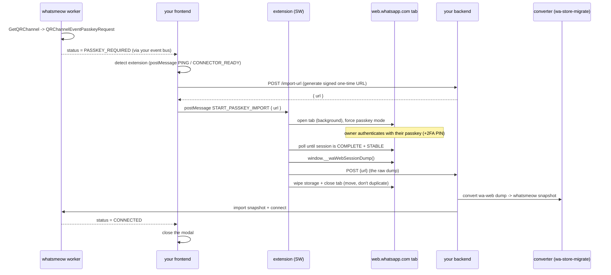

# Pairing a passkey-locked WhatsApp account via session import

A complete, framework-agnostic guide to pairing a **passkey-locked** WhatsApp
account with a [whatsmeow](https://github.com/tulir/whatsmeow) client, using a
browser extension to import the owner's already-authenticated WhatsApp Web
session.

This document is generic: it describes the moving parts and the contracts
between them so you can implement it in **your** stack (any backend, any
frontend framework, your own whatsmeow worker). The companion browser extension
in this repository is the one reusable, ready-made piece.

---

## 1. The problem

WhatsApp is rolling out **passkey-locked device linking** (internally
"Shortcake" on web, "CRSC" on the phone). For accounts placed in that bucket,
the server **refuses** the normal QR / pairing-code linking and requires a
**WebAuthn passkey assertion produced by the account owner's own
authenticator** before a companion device may link.

Practical consequences for a companion library (whatsmeow, Baileys, ...):

- A **headless** client cannot fabricate the assertion. WebAuthn requires the
  authenticator to be present: platform passkeys are non-exportable and bound to
  the owner's device; hybrid/caBLE needs Bluetooth proximity to the owner's
  phone. None of this is available to a remote, credential-less caller.
- The server **verifies** the assertion against the account's registered public
  key with a fresh challenge. A forged assertion is silently rejected.
- Switching the companion platform or client version does not help: the gate is
  enforced **server-side, per account**.

So you **cannot** pair a passkey-locked account by driving QR from a headless
whatsmeow client. The only thing that can satisfy the server is the **real
owner**, on **their** device/browser, using **their** passkey.

## 2. The solution

The owner authenticates `web.whatsapp.com` in **their** browser with **their**
real passkey (the native WhatsApp Web flow). That produces a fully registered
**companion session** inside the browser. A browser extension then:

1. Extracts ("dumps") that authenticated session from WhatsApp Web's local
   storage.
2. Your backend converts it to the whatsmeow store format.
3. Your whatsmeow worker imports it and **reconnects** as that companion - no
   re-pairing needed, because the companion is already registered on the server.

The credential material (noise key, identity key, the server-signed device
identity) is portable: reconnecting only requires presenting it over the Noise
handshake. This is **using** the real passkey session, not bypassing anything.

> **Move, don't duplicate.** WhatsApp does not run the same companion device in
> two places. After extracting the session you must **clear** the browser's
> WhatsApp Web storage, otherwise a reopened tab brings up a second live socket
> on the same credentials and the server issues `stream_error_replaced`, killing
> one side (and, with auto-reconnect, they ping-pong).

## 3. Architecture

Five components cooperate. Only #4 (the extension) is provided here; the rest you
implement in your own stack.

| # | Component | Role |
|---|-----------|------|
| 1 | **whatsmeow worker** (yours) | Detects the passkey requirement; imports the session; connects. |
| 2 | **backend / API** (yours) | Issues a signed one-time upload URL; receives the dump; stores it; triggers conversion + import. |
| 3 | **converter** ([`wa-store-migrate`](https://www.npmjs.com/package/wa-store-migrate)) | Converts the WhatsApp Web dump into a whatsmeow snapshot. |
| 4 | **browser extension** (this repo) | Drives `web.whatsapp.com`, forces passkey mode, dumps the paired session, uploads it. |
| 5 | **frontend UI** (yours) | Detects the extension; guides the user; hands the signed URL to the extension. |



## 4. whatsmeow: detecting the passkey requirement

The passkey requirement is **not** delivered through `AddEventHandler`. It
arrives on the **QR channel** returned by `GetQRChannel`. For a passkey-locked
account, instead of (or in addition to) `QRChannelEventCode`, the channel emits
`QRChannelEventPasskeyRequest`, whose `item.PasskeyRequest` is an
`*events.PairPasskeyRequest` carrying the WebAuthn challenge.

> `QRChannelEventPasskeyRequest` exists in whatsmeow builds that carry passkey
> support (see the upstream work in `tulir/whatsmeow#1186`). If your pinned
> whatsmeow does not expose it, you need a build that does.

```go
qrChan, err := client.GetQRChannel(ctx)
if err != nil { /* handle */ }
go client.Connect()

passkeyRequired := false
for item := range qrChan {
    switch item.Event {
    case whatsmeow.QRChannelEventCode:
        // IMPORTANT: once passkey is required, stop emitting QR. The channel
        // keeps producing QR codes for a passkey-locked account even though QR
        // pairing can never complete; emitting them confuses your UI.
        if passkeyRequired {
            continue
        }
        publishQR(item.Code, item.Timeout)

    case whatsmeow.QRChannelEventPasskeyRequest:
        passkeyRequired = true
        // Signal your app: this connection needs the extension flow.
        // req := item.PasskeyRequest  // *events.PairPasskeyRequest (challenge)
        publishPasskeyRequired()

    case whatsmeow.QRChannelEventSuccess:
        // Normal (non-passkey) accounts finish here. Passkey accounts do not.

    case whatsmeow.QRChannelEventTimeout, whatsmeow.QRChannelEventError:
        // channel ended
    }
}
```

Surface `publishPasskeyRequired()` to your frontend however you already push
connection status (websocket, SSE, polling, webhook). The frontend uses it to
switch from "show QR" to "resolve passkey via the extension".

## 5. The browser extension (this repo)

The extension is the only piece that must touch `web.whatsapp.com`. It has three
scripts:

- **`src/content/wa-web-dump.js`** (injected into `web.whatsapp.com`, MAIN
  world). Exposes `window.__waWebSessionDump()` on demand. It walks WhatsApp
  Web's IndexedDB / localStorage and returns the session as JSON.
- **`src/content/app-bridge.ts`** (injected into **your** app pages). The
  detection + message relay bridge between your page and the service worker.
- **`src/background/index.ts`** (MV3 service worker). Orchestration.

### 5.1 What the service worker does

1. Receives `START_PASSKEY_IMPORT { url }` from your page (via the bridge).
2. Opens `web.whatsapp.com` in a **background** tab (so detection happens before
   focus is stolen).
3. **Detects a pre-existing session** (reads `last-wid-md`). If another account
   is already logged in on this browser, it asks your page for consent
   (`EXISTING_SESSION`) and, on `CLEAR_AND_CONTINUE`, wipes the WhatsApp Web
   storage before proceeding.
4. **Forces passkey mode** in the tab (see 5.2), then focuses it so the owner can
   complete WhatsApp's native passkey flow (choose passkey, and enter the 2FA PIN
   if the account has two-step verification).
5. **Waits for a complete + stable session** (see 5.3), calls
   `window.__waWebSessionDump()`, and `POST`s the dump to the signed `url`.
6. **Wipes** the WhatsApp Web storage (move, don't duplicate) and closes the tab.

### 5.2 Forcing passkey mode

Injected into the page's MAIN world:

```js
window.requireLazy(
  ['WAWebLinkDeviceEvents', 'WAWebAltDeviceLinkingApi', 'WAWebPairingType'],
  (Events, AltApi, PairingType) => {
    AltApi.setPairingType(PairingType.PairingType.SHORTCAKE_PASSKEY);
    Events.WAWebLinkDeviceEvents.triggerPasskeyPrologueRequest();
  }
);
```

This only **steers the WhatsApp Web client** toward the passkey step; the passkey
prologue itself is server-driven and only fires for accounts in the passkey
bucket. The extension deliberately does **not** call `navigator.credentials.get`
itself - WhatsApp Web drives the real WebAuthn assertion (and the 2FA PIN) as a
native, user-gestured flow. The injection self-retries until
`window.requireLazy` is available, otherwise the QR would show.

### 5.3 Completion detection (avoids the 401)

A **premature** dump (taken mid-registration, or of a session superseded by a
retry) produces credentials the server rejects with `logged_out_401` the instant
the imported client connects (`connectedFor: 0`). To avoid it, only dump when the
session is **complete and stable**:

- `device.noiseKey`, `device.identityKey`, `device.account` and `device.meJid`
  are all present, **and**
- `device.meJid` is unchanged across two consecutive polls.

The extension polls every 2.5s for up to ~5 minutes. If the account is paired but
the noise key never materializes (a WhatsApp Web schema change broke the dumper),
it fails fast with a distinct `noise_key_unavailable` reason instead of a generic
timeout.

### 5.4 Configuring the extension for your app

Edit **`manifest.config.ts`**: set `APP_HOSTS` to the origin(s) where your web
app runs (add `http://localhost/*` while developing). Keep the same list in
`APP_HOST_PATTERNS` in `src/background/index.ts` (used to inject the bridge into
already-open tabs on install).

`host_permissions`, `browsingData` (to wipe the WhatsApp Web session), and the
`scripting`/`tabs` permissions are required. `browsingData` is scoped to
`web.whatsapp.com` only.

## 6. Your frontend UI

Your UI owns the connection-management screen. When a connection reports
`PASSKEY_REQUIRED`, render a "resolve" panel instead of the QR. Everything is
driven by `window.postMessage` against the extension bridge - the protocol is in
[section 12](#12-the-postmessage-protocol).

Recommended states:

1. **Detect the extension** - `postMessage` a `PING`; if you receive
   `CONNECTOR_READY` within ~1.5s, it is installed. Ping a few times to cover the
   content-script attaching a beat late.
2. **Not installed** - show install instructions (there is no store-hosted build;
   users load the unpacked `dist/`, or you distribute a `.crx`).
3. **Installed** - show a **Resolve authentication** button. On click: ask your
   backend for a signed upload URL, then `postMessage`
   `START_PASSKEY_IMPORT { url }`.
4. **Existing session** - if you receive `EXISTING_SESSION { number }`, show a
   consent prompt ("another account is logged in on this browser; log it out and
   continue?"). On confirm, `postMessage` `CLEAR_AND_CONTINUE`; on cancel,
   `CANCEL_IMPORT`.
5. **In progress / done** - on `IMPORT_SENT` show "connecting..."; on
   `IMPORT_ERROR { reason }` show the error and let the user retry. Close the
   modal when your own connection status reaches `CONNECTED`.

Two robustness notes learned the hard way:

- Make `PASSKEY_REQUIRED` **sticky** in the modal: once latched, ignore stray
  `qrcode`/disconnect status updates so the modal does not flip back to QR while
  the worker keeps cycling QR events. Release the latch only on `CONNECTED` or
  when the modal is reopened.
- If you fetch the connection status on open, guard that async response against
  the latch too, so a stale in-flight response can't overwrite the passkey UI.

## 7. Your backend

Two endpoints and a storage step. The signed URL is a **one-time, short-lived**
capability handed to the extension.

### 7.1 Generate the upload URL

```
POST /import-url            (authenticated as your app user)
  -> verify the target connection is passkey-pending
  -> sign a short-lived (e.g. 10 min) one-time token:
       jwt.sign({ connectionId, purpose: 'wa-import', jti }, SECRET, { expiresIn })
       + store the jti as a single-use nonce (e.g. Redis SET NX EX)
  -> return { url: `${PUBLIC_BASE}/import/${token}` }
```

`PUBLIC_BASE` must be reachable **by the owner's browser** (the extension POSTs
there), i.e. your public API origin, not an internal hostname.

Fail **closed**: if the signing secret is unset, refuse to issue URLs.

### 7.2 Receive the dump

```
POST /import/:token         (public; the token is the auth)
  -> verify the token AND atomically consume the nonce (GETDEL); reused -> 410
  -> read the raw JSON dump from the body (allow a large body, e.g. 25 MB)
  -> (optional) sanity-check the sender against the target connection
  -> store the dump (S3-compatible object storage) or hand it straight to the converter
  -> trigger conversion + import (section 8, 9)
```

### 7.3 Moving the dump between services

If your converter/worker are separate services, don't inline a multi-MB dump
through your event bus. Store it (S3/MinIO), then pass a **presigned URL** that
the next service fetches. Make sure that presigned URL's host is reachable by the
consuming service (a common cross-service gotcha: presigning with an internal
`minio:9000` host that another container can't resolve). Keep the presign TTL
short.

## 8. Conversion: `wa-store-migrate`

[`wa-store-migrate`](https://www.npmjs.com/package/wa-store-migrate) converts
between WhatsApp session formats through a canonical intermediate representation.

```ts
import { snapshot, bufferJsonReviver } from 'wa-store-migrate';

// rawDump = the JSON your extension posted (byte fields are { type: 'Buffer', data: '<base64>' })
const ir = snapshot.from('wa-web', coerceBufferJson(rawDump));
const whatsmeowSnapshot = snapshot.toJSON('whatsmeow', ir);
// whatsmeowSnapshot: device identity + prekeys + identities + sessions + sender keys
// (byte leaves as base64 strings) - feed this to your Go importer.
```

## 9. Importing into the whatsmeow store (Go)

Populate a fresh device in your whatsmeow `sqlstore.Container` from the snapshot,
then connect. This does **not** re-pair - the companion is already registered.

Key details, each a gotcha in disguise:

- **Delete any leftover device first** (from an aborted pairing attempt), then
  `container.NewDevice()`.
- Set `device.ID` (the `meJid`), `device.LID`, `RegistrationID`, `NoiseKey`,
  `IdentityKey`, `SignedPreKey` (with its 64-byte signature), `Account` (the
  `ADVSignedDeviceIdentity`), `Platform`, and `Initialized = true`.
- **`advSecretKey`**: WhatsApp Web wipes it right after pairing. Substitute 32
  zero bytes - it is only needed to *re-pair*, never to *reconnect*.
- Import pre-keys, identities, sessions, sender keys, contacts, privacy tokens.
  (If your `Container` does not expose its `*sql.DB`, open a second handle with
  the same SQLite driver to insert pre-keys at explicit key IDs.)
- **Skip app-state** (sync keys / versions). The server returns a full app-state
  snapshot and whatsmeow re-requests the sync keys from the phone on first
  connect, so it self-heals.
- `client.Connect()` afterwards. A `stream:error 515` immediately after connect
  is routine - reconnect (enable auto-reconnect).

```go
func populateDeviceIdentity(device *store.Device, d *WebDeviceSnapshot) error {
    jid, err := types.ParseJID(d.MeJid)
    if err != nil { return err }
    device.ID = &jid
    if d.MeLid != "" {
        lid, err := types.ParseJID(d.MeLid)
        if err != nil { return err }
        device.LID = lid
    }

    device.RegistrationID = d.RegistrationID
    device.NoiseKey = mustKeyPair(d.NoiseKey)
    device.IdentityKey = mustKeyPair(d.IdentityKey)
    device.SignedPreKey = &keys.PreKey{
        KeyPair:   mustKeyPair(d.SignedPreKey.KeyPair),
        KeyID:     d.SignedPreKey.KeyID,
        Signature: mustSig64(d.SignedPreKey.Signature),
    }

    // wa-web wipes the ADV secret post-pairing; it is not needed to reconnect.
    advSecret := decode(d.AdvSecretKey)
    if len(advSecret) == 0 {
        advSecret = make([]byte, 32)
    }
    device.AdvSecretKey = advSecret

    device.Platform = d.Platform
    device.Initialized = true
    if d.Account != nil {
        device.Account = &waAdv.ADVSignedDeviceIdentity{
            Details:             decode(d.Account.Details),
            AccountSignatureKey: decode(d.Account.AccountSignatureKey),
            AccountSignature:    decode(d.Account.AccountSignature),
            DeviceSignature:     decode(d.Account.DeviceSignature),
        }
    }
    return nil
}

// then: container.PutDevice(ctx, device); reload via GetDevice; import prekeys/
// identities/sessions/senderKeys/contacts; NewClient(device); client.Connect()
```

If the reconnect is immediately met with `logged_out_401` / `connectedFor: 0`,
the dump was premature or superseded - see 5.3.

## 10. Delivering the "passkey required" event reliably

If your whatsmeow layer delivers events to your app through a **per-session
subscription filter** (only some event types forwarded), make the
"passkey required" event an **always-delivered control event**. Otherwise
sessions created before you added the event to the filter (i.e. every existing
session in production) will never receive it, and you would have to backfill each
one. Treat pairing-lifecycle events as non-optional at the delivery layer.

## 11. Security, limits and gotchas

- **No headless bypass.** The assertion needs the owner's authenticator. This
  approach *uses* the real passkey session; it does not defeat the passkey.
- **Premature dump -> 401.** Wait for a complete + stable session before
  uploading (5.3).
- **Move, don't duplicate.** Wipe the browser's WhatsApp Web storage after the
  dump, or the reopened web tab and your worker fight over the same companion
  (`stream_error_replaced`).
- **Noise-key fragility.** The dumper can only read the noise key through a
  WhatsApp Web internal module; a schema change upstream can break it. Surface a
  distinct error and monitor.
- **Runtime integrity checkpoint.** WhatsApp can push a separate anti-abuse
  challenge (passkey or captcha) to an already-connected companion; a headless
  client cannot answer a passkey checkpoint, and whatsmeow surfaces it as an
  ordinary logout. Monitor for repeated logouts and re-run the import.
- **The dump is impersonation-grade.** It contains the device's secret keys.
  Encrypt it at rest, keep presign TTLs short, and capture only the fields your
  importer actually uses (device identity, prekeys, identities, sessions, sender
  keys, contacts, privacy tokens) - do not exfiltrate message secrets, device
  lists or app-state you are going to discard.
- **Terms of service / store policy.** This automates WhatsApp Web and relocates
  a session; it may violate WhatsApp's ToS and browser-extension store policies.
  Get the account owner's explicit consent, and distribute the extension
  privately/unlisted or via enterprise policy rather than a public listing.

## 12. The postMessage protocol

The contract between **your page** and the **extension bridge**. All messages are
`window.postMessage(..., '*')` on the app page; the bridge relays to/from the
service worker.

**Page -> extension** (send with `{ target: 'wa-passkey-connector', ... }`):

| type | payload | meaning |
|------|---------|---------|
| `PING` | - | probe for the extension |
| `START_PASSKEY_IMPORT` | `{ url }` | begin the flow with a signed upload URL |
| `CLEAR_AND_CONTINUE` | - | consent to wipe an existing session and continue |
| `CANCEL_IMPORT` | - | abort the flow |

**Extension -> page** (receive with `{ source: 'wa-passkey-connector', ... }`):

| type | payload | meaning |
|------|---------|---------|
| `CONNECTOR_READY` | - | the extension is installed / present |
| `EXISTING_SESSION` | `{ number }` | another account is logged in; ask for consent |
| `IMPORT_SENT` | - | the dump was uploaded; now await your own CONNECTED |
| `IMPORT_ERROR` | `{ reason }` | `timeout` / `noise_key_unavailable` / `HTTP <n>` / `network` |

Minimal detection helper:

```js
function detectConnector(timeoutMs = 1500) {
  return new Promise((resolve) => {
    let done = false;
    const onMsg = (e) => {
      if (e.source === window && e.data?.source === 'wa-passkey-connector'
          && e.data?.type === 'CONNECTOR_READY') {
        done = true; window.removeEventListener('message', onMsg); resolve(true);
      }
    };
    window.addEventListener('message', onMsg);
    const ping = () => window.postMessage({ target: 'wa-passkey-connector', type: 'PING' }, '*');
    ping();
    const iv = setInterval(ping, 300);
    setTimeout(() => { if (!done) { clearInterval(iv); window.removeEventListener('message', onMsg); resolve(false); } }, timeoutMs);
  });
}
```

Start the flow:

```js
const { url } = await fetch('/import-url', { method: 'POST' }).then((r) => r.json());
window.postMessage({ target: 'wa-passkey-connector', type: 'START_PASSKEY_IMPORT', url }, '*');
```

---

*The extension talks to your app via the protocol above and to your backend via a
single `POST` of the dump to the signed URL. Everything else - how you detect the
passkey requirement, store the dump, convert it, and import it into whatsmeow -
is yours to wire into your own architecture using the snippets above.*
