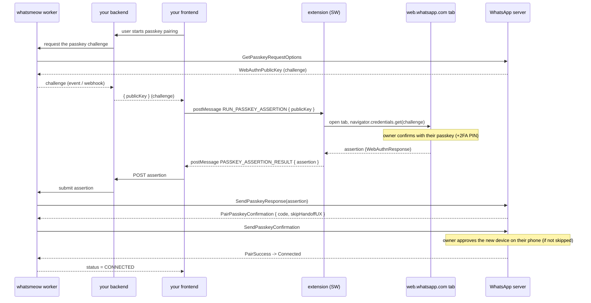

# Pairing a passkey-locked WhatsApp account with whatsmeow

A complete, framework-agnostic guide to linking a companion device on a
**passkey-locked** WhatsApp account with a
[whatsmeow](https://github.com/tulir/whatsmeow) client, by **delegating the
WebAuthn assertion** to the account owner's own browser - no session dump, no
impersonation-grade copy.

This document is generic: it describes the moving parts and the contracts
between them so you can implement it in **your** stack (any backend, any
frontend framework, your own whatsmeow worker). The companion browser extension
in this repository is the one reusable, ready-made piece: it runs
`navigator.credentials.get` on `web.whatsapp.com` and hands the assertion back.

> **Two ways to solve this exist.** An older approach *dumps* the owner's
> already-authenticated WhatsApp Web session and imports it into the whatsmeow
> store. This guide documents the **cleaner** approach: let whatsmeow drive the
> real pairing handshake and only delegate the one thing it cannot do headless -
> the passkey signature. The result is a **freshly linked device with its own
> credentials**, not a copy of the owner's session.

---

## 1. The problem

WhatsApp is rolling out **passkey-locked device linking** (internally
"Shortcake" on web, "CRSC" on the phone). For accounts placed in that bucket,
the server **refuses** the normal QR / pairing-code linking and requires a
**WebAuthn passkey assertion produced by the account owner's own
authenticator** before a companion device may link.

Practical consequences for a companion library (whatsmeow, Baileys, ...):

- A **headless** client cannot fabricate the assertion. WebAuthn requires the
  authenticator to be present: platform passkeys are non-exportable and bound to
  the owner's device; hybrid/caBLE needs Bluetooth proximity to the owner's
  phone. None of this is available to a remote, credential-less caller.
- The server **verifies** the assertion against the account's registered public
  key with a fresh, single-use challenge. A forged assertion is silently
  rejected.
- Switching the companion platform or client version does not help: the gate is
  enforced **server-side, per account**.

So the assertion must be produced by the **real owner**, on **their** device /
browser, with **their** passkey. Everything else in the linking handshake can be
driven by your whatsmeow client.

## 2. The solution: delegate only the assertion

whatsmeow **is** the device being linked. It performs the entire companion
pairing handshake itself - it just cannot sign the WebAuthn challenge. So:

1. Your whatsmeow client connects (unpaired) and **fetches the passkey
   challenge** the server issued for this account.
2. Your app relays that challenge to a page open in the **owner's** browser.
3. The browser extension runs `navigator.credentials.get(challenge)` on the
   `web.whatsapp.com` origin. The owner confirms with their passkey (Windows
   Hello, phone, security key, ...) and the 2FA PIN if the account has two-step
   verification. This yields a **WebAuthn assertion**.
4. The assertion travels back to your whatsmeow client, which submits it to the
   server (`SendPasskeyResponse`) and confirms the handoff
   (`SendPasskeyConfirmation`).
5. The server links the device. whatsmeow emits `PairSuccess`, then `Connected`.

The linked device is **new** - it has its own registration id, noise key and
identity key, minted by the normal companion pairing. Nothing of the owner's
existing session is read or moved. This is **using** the passkey exactly as
designed, for a single challenge, with the owner present.

> **No "move, don't duplicate" problem.** Because this is a fresh companion (not
> a copy of the owner's web session), there is no second live socket fighting
> over the same credentials, and nothing to wipe.

## 3. Architecture

Four components cooperate. Only #3 (the extension) is provided here; the rest you
implement in your own stack.

| # | Component | Role |
|---|-----------|------|
| 1 | **whatsmeow worker** (yours) | Fetches the challenge; submits the assertion; confirms; connects. |
| 2 | **backend / API** (yours) | Relays the challenge to the frontend and the assertion to the worker (both ephemeral). |
| 3 | **browser extension** (this repo) | Runs `navigator.credentials.get` on `web.whatsapp.com`, returns the assertion. |
| 4 | **frontend UI** (yours) | Detects the extension; fetches the challenge; drives the extension; shows progress. |



## 4. whatsmeow: the passkey pairing loop

You need a whatsmeow build with **passkey pairing support** - specifically the
methods `SendPasskeyResponse`, `SendPasskeyConfirmation` and the internal
`GetPasskeyRequestOptions`, plus the `types.WebAuthnPublicKey` /
`types.WebAuthnResponse` types and the `events.PairPasskey*` events (all in
`pair-passkey.go`). This landed **upstream** in
[`tulir/whatsmeow#1186`](https://github.com/tulir/whatsmeow/pull/1186) ("pair:
add support for passkeys", merged 2026-07), so a current `go.mau.fi/whatsmeow`
release has everything you need - **no fork required**. Just make sure your
pinned version is at or after that merge.

> Other companion libraries (e.g. [Baileys](https://github.com/WhiskeySockets/Baileys))
> do not expose passkey pairing yet, so the response direction of this flow is
> whatsmeow-only for now. The browser extension itself is library-agnostic - it
> only produces a WebAuthn assertion.

The passkey pairing has a **request** direction (get the challenge) and a
**response** direction (submit the assertion + confirm). The extension only sits
between them.

### 4.1 Fetch the challenge

On connect, the server sends a **QR code by default**; the passkey notification
does **not** reliably auto-fire. Fetch the challenge explicitly once the client
is connected (unpaired):

```go
// client is connected and unpaired.
pk, err := client.DangerousInternals().GetPasskeyRequestOptions(ctx)
if err != nil {
    // No passkey for this account (or not passkey-locked) -> stay on QR.
    return
}
// pk is *types.WebAuthnPublicKey: { Challenge, Timeout, RelyingPartID,
// AllowCredentials[], UserVerification, Extensions }. Its binary fields are
// jsonbytes.UnpaddedURLBytes (base64url). Marshal it to JSON and relay it to
// your frontend as-is.
challengeJSON, _ := json.Marshal(pk)
publishPasskeyChallenge(challengeJSON) // -> your event bus / webhook -> frontend
```

If your build delivers the challenge via the QR channel instead, handle it
there - `item.PasskeyRequest.PublicKey` on `QRChannelEventPasskeyRequest` is the
same `*types.WebAuthnPublicKey`:

```go
qrChan, _ := client.GetQRChannel(ctx)
go client.Connect()
for item := range qrChan {
    switch item.Event {
    case whatsmeow.QRChannelEventCode:
        publishQR(item.Code, item.Timeout) // normal accounts
    case whatsmeow.QRChannelEventPasskeyRequest:
        publishPasskeyChallenge(item.PasskeyRequest.PublicKey)
    }
}
```

The challenge is **single-use** with a short TTL (~10 min). Mint it when the
user is actually ready to sign (i.e. on their click), not speculatively on every
connect. A retry needs a fresh challenge (a new connect / a new
`GetPasskeyRequestOptions`).

### 4.2 Submit the assertion

When the assertion comes back from the browser (section 5), unmarshal it into
`types.WebAuthnResponse` and submit it:

```go
var resp types.WebAuthnResponse
if err := json.Unmarshal(assertionJSON, &resp); err != nil { /* 400 */ }

if err := client.SendPasskeyResponse(ctx, &resp); err != nil {
    // server rejected the assertion (stale challenge, wrong account, ...)
}
```

`types.WebAuthnResponse` maps 1:1 to what the browser's `navigator.credentials.
get(...).toJSON()` produces:

```go
type WebAuthnResponse struct {
    ID       string                     `json:"id"`
    RawID    jsonbytes.UnpaddedURLBytes `json:"rawId"`
    Type     string                     `json:"type"`
    Response WebAuthnResponseData       `json:"response"`
}
type WebAuthnResponseData struct {
    ClientDataJSON    jsonbytes.UnpaddedURLBytes  `json:"clientDataJSON"`
    AuthenticatorData jsonbytes.UnpaddedURLBytes  `json:"authenticatorData"`
    Signature         jsonbytes.UnpaddedURLBytes  `json:"signature"`
    UserHandle        *jsonbytes.UnpaddedURLBytes `json:"userHandle"`
}
```

### 4.3 Confirm the handoff

After `SendPasskeyResponse`, the server's continuation is **auto-routed** on the
same socket (you wire nothing). It surfaces as `events.PairPasskeyConfirmation`:

```go
client.AddEventHandler(func(evt any) {
    switch e := evt.(type) {
    case *events.PairPasskeyConfirmation:
        // e.Code          - a short code shown to the user (informational)
        // e.SkipHandoffUX - whether the phone handoff is skipped
        if !e.SkipHandoffUX {
            // The owner will approve the new device on their phone. Call confirm;
            // the pairing completes once they tap approve.
            _ = client.SendPasskeyConfirmation(ctx)
        }
        // When SkipHandoffUX is true, whatsmeow's QR-channel loop auto-confirms
        // for you - do nothing.
    case *events.PairSuccess:
        // device linked. Connected follows.
    case *events.PairPasskeyError:
        // e.Error, e.Continuation
    }
})
```

Two behaviours to know:

- On the QR channel, whatsmeow **auto-calls `SendPasskeyConfirmation`** when
  `SkipHandoffUX == true`, and only surfaces the confirmation item (so you must
  confirm) when `SkipHandoffUX == false`. If you drive it from the event handler
  as above, call confirm only in the `!SkipHandoffUX` branch to avoid confirming
  twice.
- With `SkipHandoffUX == false`, WhatsApp shows the owner a **security handoff**
  on their phone; the device links when they approve it. The `Code` is
  informational ("check your phone").

That is the whole worker side: fetch challenge -> submit assertion -> confirm ->
`PairSuccess` -> `Connected`. No store surgery, no re-pairing.

## 5. The browser extension (this repo)

The extension is the only piece that touches `web.whatsapp.com`. All logic lives
in one place:

- **`src/background/index.ts`** (MV3 service worker). It owns two things:
  - **The page bridge** (`bridgeInPage`) - a small detection + message relay,
    injected at runtime into your authorized app pages (there is no static
    content script; see [§5.3](#53-configuring-the-extension-for-your-app-multi-instance)).
  - **The assertion core** - on `RUN_PASSKEY_ASSERTION { publicKey }` it opens
    `web.whatsapp.com`, runs `navigator.credentials.get` in the page's MAIN world
    with your challenge, and returns the assertion
    (`PASSKEY_ASSERTION_RESULT { assertion }`) over whichever transport the page
    used (content-script bridge or parent-domain port).

### 5.1 What the service worker does

1. Receives `RUN_PASSKEY_ASSERTION { requestId, publicKey }` from your page.
2. Opens `web.whatsapp.com` in a **focused** tab (so the OS passkey prompt has
   focus) and waits for it to load.
3. Injects `runPasskeyAssertionInPage(publicKey)` into the page's **MAIN world**
   and awaits its result. That function is the standard WebAuthn call:

   ```js
   const credential = await navigator.credentials.get({
     publicKey: {
       challenge: base64UrlToBuffer(publicKey.challenge),
       rpId: publicKey.rpId,                     // "whatsapp.com"
       allowCredentials: (publicKey.allowCredentials || []).map((c) => ({
         id: base64UrlToBuffer(c.id), type: 'public-key', transports: c.transports,
       })),
       userVerification: publicKey.userVerification,
       timeout: publicKey.timeout,
     },
   });
   return credential.toJSON(); // -> { id, rawId, type, response{...} }, base64url
   ```

4. Returns `PASSKEY_ASSERTION_RESULT { requestId, assertion }` (or
   `{ requestId, error }`) to your page, then closes the tab.

The extension runs on the `web.whatsapp.com` **origin** so the assertion is
scoped to `rpId = whatsapp.com` (web.whatsapp.com is in scope). A plain
`web.whatsapp.com` tab is enough - no logged-in session, no special page state.

### 5.2 Encoding: keep the assertion verbatim

WebAuthn wire encoding here is **base64url, unpadded**. whatsmeow decodes these
fields with Go's strict `RawURLEncoding`, which **rejects** `=` padding and the
`+` / `/` of standard base64.

- `credential.toJSON()` (the preferred path) already emits unpadded base64url.
- If you build the response manually, strip padding and use the URL alphabet:
  `btoa(bin).replace(/\+/g,'-').replace(/\//g,'_').replace(/=+$/,'')`.
- **Forward the assertion as strings, verbatim, through every layer** (frontend
  -> backend -> worker). Never round-trip it through a `Buffer`/base64 re-encode
  (that would re-pad it and break the server's verification), and never store or
  transform it - it is small; pass it through.

The challenge's binary fields (`challenge`, `allowCredentials[].id`) are likewise
base64url strings; `base64UrlToBuffer` decodes them to `ArrayBuffer` for the API.
The server-provided challenge does not carry binary-input extensions
(`prf`/`largeBlob`) in practice; pass `extensions` through as-is.

### 5.3 Configuring the extension for your app (multi-instance)

One build serves **every** instance; there is no hard-coded app host. The MV3
manifest is static, so the app origin is resolved at **runtime** via one of two
paths - pick per instance:

**A. Universal path (any domain + `localhost`).** The owner opens the app tab,
clicks the connector icon, and hits **Authorize this instance**. Chrome grants
host permission for that exact origin (drawn from the broad
`optional_host_permissions`, so there is no install-time "all sites" warning),
the worker injects the page bridge, and the grant persists across restarts. Your
page then uses the same `window.postMessage` protocol as before ([section
10](#10-the-postmessage-protocol)). This is the default and needs no build-time
config.

> MV3 cannot let a web page silently push its URL into an installed extension, and
> granting a new origin **requires a user gesture**. So the one-time popup click
> is the closest to "automatic" the platform allows for arbitrary domains. The
> popup pre-fills the current tab's URL, so it is effectively "open popup ->
> Authorize".

**B. Parent-domain path (domains you control, zero-click).** Bake your own
domains in at build time:

```bash
CONNECTOR_PARENT_HOSTS="https://*.yourproduct.com/*,https://*.other.com/*" npm run build
```

Each pattern is added to `host_permissions` (zero-click bridge, so path A's
`postMessage` API works with no popup step) **and** to `externally_connectable`
(so a page can call `chrome.runtime.connect(EXTENSION_ID)` directly, no content
script at all). Chrome rejects wildcard-only patterns here, so list concrete
parent domains.

Permissions: `scripting`, `tabs`, `activeTab`, `storage`, plus
`host_permissions` for `web.whatsapp.com` (always) and your parent domains (if
any). App instances on arbitrary domains live in `optional_host_permissions`
and are granted at runtime. There is no `browsingData` and no code that reads the
WhatsApp Web session.

## 6. Your frontend UI

Your UI owns the connection-management screen. When a connection needs a passkey,
render a "resolve" panel instead of the QR. Everything is driven by
`window.postMessage` against the extension bridge - the protocol is in
[section 10](#10-the-postmessage-protocol).

Recommended flow:

1. **Detect the extension** - `postMessage` a `PING`; if you receive
   `CONNECTOR_READY` within ~1.5s, it is installed **and authorized for this
   origin**. Ping a few times to cover the bridge attaching a beat late.
2. **No `CONNECTOR_READY`** - two cases to tell the user apart:
   - **Not installed** - link to your store listing or show load-unpacked
     instructions for `dist/`.
   - **Installed but this origin is not authorized yet** (only happens on
     arbitrary domains, never on a `CONNECTOR_PARENT_HOSTS` domain) - tell the
     user to click the connector's toolbar icon and hit **Authorize this
     instance**, then retry detection. You cannot trigger that grant from the
     page - MV3 requires the click to happen in the extension popup.
3. **Resolve** - on the user's click:
   1. fetch the challenge from your backend (`{ publicKey }`);
   2. `postMessage` `RUN_PASSKEY_ASSERTION { requestId, publicKey }`;
   3. on `PASSKEY_ASSERTION_RESULT { assertion }`, `POST` the assertion to your
      backend;
   4. show "connecting..."; close the modal when your own connection status
      reaches `CONNECTED`.

Correlate the round trip with a `requestId` so overlapping runs never cross
wires, and put a timeout on waiting for the result (the OS prompt can sit open
for a while). Two robustness notes:

- Make `PASSKEY_REQUIRED` **sticky** in the modal: once latched, ignore stray
  `qrcode`/disconnect status updates so the modal does not flip back to QR while
  the worker keeps cycling QR events. Release the latch only on `CONNECTED` or
  when the modal is reopened.
- The challenge is single-use with a short TTL. If your backend mints it on
  demand and the round trip is slow, handle a "not ready yet / expired" answer
  by re-fetching a fresh challenge.

## 7. Your backend

The backend is a thin, **stateful-but-ephemeral** relay. It never stores the
challenge or the assertion beyond the pairing.

### 7.1 Get the challenge to the frontend

```
GET /passkey-challenge/:connectionId     (authenticated as your app user)
  -> if you already have a fresh challenge cached for this connection, return it
  -> else ask your worker to fetch one (section 4.1); the worker emits it on your
     event bus; stash it briefly (e.g. Redis, TTL ~= the challenge TTL) keyed by
     connection, and return { publicKey } (poll or push via socket)
```

Mint on demand (on the user's action), because the challenge is single-use.

### 7.2 Relay the assertion to the worker

```
POST /passkey-response/:connectionId     (authenticated as your app user)
  body = the WebAuthnResponse the extension returned
  -> forward it verbatim to the worker (RPC / command bus) which calls
     SendPasskeyResponse (section 4.2)
  -> return 202; the pairing outcome arrives via your normal connection-status
     channel (CONNECTED)
```

Forward the assertion as a JSON object of strings. **Do not** decode/re-encode
its base64url fields anywhere on the path (section 5.2).

## 8. Delivering the "passkey" events reliably

If your whatsmeow layer delivers events to your app through a **per-session
subscription filter** (only some event types forwarded), make the passkey
lifecycle events (**challenge required** and **confirmation**)
**always-delivered control events**. Otherwise sessions created before you added
those events to the filter (i.e. every existing session in production) will never
receive them, and you would have to backfill each one. Treat pairing-lifecycle
events as non-optional at the delivery layer.

## 9. Security, limits and gotchas

- **No headless bypass.** The assertion needs the owner's authenticator, for a
  single server-issued challenge, with the owner present. This *uses* the passkey
  as designed; it does not defeat it.
- **Fresh device, no impersonation copy.** Unlike a session dump, the linked
  device has its own credentials. Nothing of the owner's existing session is read
  or transported. The only sensitive value in flight is the one-shot WebAuthn
  assertion.
- **Single-use challenge.** Mint on the user's action; a retry needs a fresh one.
- **Encoding is unforgiving.** base64url unpadded end to end; never re-pad or
  standard-base64 the assertion (section 5.2).
- **User gesture / focus.** Some authenticators want the tab focused / a user
  gesture. Open the `web.whatsapp.com` tab focused (the extension does), and
  drive the flow from the user's click.
- **Runtime integrity checkpoint.** WhatsApp can later push an anti-abuse
  challenge (passkey or captcha) to an already-connected companion; a headless
  client cannot answer a passkey checkpoint and whatsmeow surfaces it as an
  ordinary logout. Monitor for repeated logouts and re-run the pairing.
- **Terms of service / store policy.** This automates a `navigator.credentials.
  get` on `web.whatsapp.com`; it may still touch WhatsApp's ToS and
  browser-extension store policies. Get the account owner's explicit consent, and
  prefer private/unlisted or enterprise distribution over a public listing.

## 10. The postMessage protocol

The contract between **your page** and the **extension bridge**. All messages are
`window.postMessage(..., '*')` on the app page; the bridge relays to/from the
service worker.

**Page -> extension** (send with `{ target: 'wa-passkey-connector', ... }`):

| type | payload | meaning |
|------|---------|---------|
| `PING` | - | probe for the extension |
| `RUN_PASSKEY_ASSERTION` | `{ requestId, publicKey }` | run `navigator.credentials.get` with this challenge |

**Extension -> page** (receive with `{ source: 'wa-passkey-connector', ... }`):

| type | payload | meaning |
|------|---------|---------|
| `CONNECTOR_READY` | - | the extension is installed / present |
| `PASSKEY_ASSERTION_RESULT` | `{ requestId, assertion? , error? }` | the WebAuthn assertion, or an error reason |

`publicKey` is the browser-shaped mirror of `types.WebAuthnPublicKey`
(base64url strings); `assertion` is the browser-shaped mirror of
`types.WebAuthnResponse` (`credential.toJSON()`).

Minimal detection helper:

```js
function detectConnector(timeoutMs = 1500) {
  return new Promise((resolve) => {
    let done = false;
    const onMsg = (e) => {
      if (e.source === window && e.data?.source === 'wa-passkey-connector'
          && e.data?.type === 'CONNECTOR_READY') {
        done = true; window.removeEventListener('message', onMsg); resolve(true);
      }
    };
    window.addEventListener('message', onMsg);
    const ping = () => window.postMessage({ target: 'wa-passkey-connector', type: 'PING' }, '*');
    ping();
    const iv = setInterval(ping, 300);
    setTimeout(() => { if (!done) { clearInterval(iv); window.removeEventListener('message', onMsg); resolve(false); } }, timeoutMs);
  });
}
```

Run one assertion:

```js
function runAssertion(publicKey, timeoutMs = 120000) {
  return new Promise((resolve, reject) => {
    const requestId = crypto.randomUUID();
    const onMsg = (e) => {
      if (e.source !== window || e.data?.source !== 'wa-passkey-connector') return;
      if (e.data?.type !== 'PASSKEY_ASSERTION_RESULT' || e.data?.requestId !== requestId) return;
      cleanup();
      e.data.assertion ? resolve(e.data.assertion) : reject(new Error(e.data.error || 'failed'));
    };
    const cleanup = () => { window.removeEventListener('message', onMsg); clearTimeout(t); };
    const t = setTimeout(() => { cleanup(); reject(new Error('timeout')); }, timeoutMs);
    window.addEventListener('message', onMsg);
    window.postMessage({ target: 'wa-passkey-connector', type: 'RUN_PASSKEY_ASSERTION', requestId, publicKey }, '*');
  });
}

// glue: challenge -> assertion -> your backend
const { publicKey } = await fetch(`/passkey-challenge/${connId}`).then((r) => r.json());
const assertion = await runAssertion(publicKey);
await fetch(`/passkey-response/${connId}`, {
  method: 'POST', headers: { 'Content-Type': 'application/json' }, body: JSON.stringify(assertion),
});
```

### 10.1 Parent-domain path (`externally_connectable`, no content script)

On a domain you baked into `CONNECTOR_PARENT_HOSTS` at build time, the page can
talk to the extension **directly** over a runtime port - no content script, no
per-origin authorization click. The message shapes are identical to the table
above; only the transport differs (a `chrome.runtime` port instead of
`window.postMessage`). Your page needs the published **extension id**.

```js
// The extension id of your published/loaded build. Find it at chrome://extensions.
const EXTENSION_ID = 'your-published-extension-id';

function runAssertionDirect(publicKey, timeoutMs = 120000) {
  return new Promise((resolve, reject) => {
    const port = chrome.runtime.connect(EXTENSION_ID, { name: 'wa-passkey' });
    const requestId = crypto.randomUUID();
    const t = setTimeout(() => { port.disconnect(); reject(new Error('timeout')); }, timeoutMs);
    port.onMessage.addListener((msg) => {
      if (msg?.type !== 'PASSKEY_ASSERTION_RESULT' || msg.requestId !== requestId) return;
      clearTimeout(t); port.disconnect();
      msg.assertion ? resolve(msg.assertion) : reject(new Error(msg.error || 'failed'));
    });
    port.onDisconnect.addListener(() => { clearTimeout(t); reject(new Error('disconnected')); });
    port.postMessage({ type: 'RUN_PASSKEY_ASSERTION', requestId, publicKey });
  });
}
```

**One code path for both.** Try the direct port first (works only on a parent
domain where the extension exposes `chrome.runtime` to the page); fall back to
the `postMessage` bridge (any authorized domain). Same `publicKey` in, same
`assertion` out:

```js
async function resolveAssertion(publicKey) {
  const canDirect =
    typeof chrome !== 'undefined' && !!chrome.runtime?.connect && !!EXTENSION_ID;
  if (canDirect) {
    try { return await runAssertionDirect(publicKey); } catch { /* fall through */ }
  }
  return runAssertion(publicKey); // window.postMessage bridge (section 10)
}
```

Detection mirrors this: on a parent domain, open a port and `postMessage`
`{ type: 'PING' }` - a `CONNECTOR_READY` back means ready; a fast `onDisconnect`
means fall back to `detectConnector`.

---

*The extension talks to your app via the protocol above; it produces one WebAuthn
assertion per challenge and nothing else. Everything else - fetching the
challenge, relaying it, submitting the assertion to `SendPasskeyResponse`, and
confirming - is yours to wire into your own architecture using the snippets
above.*
